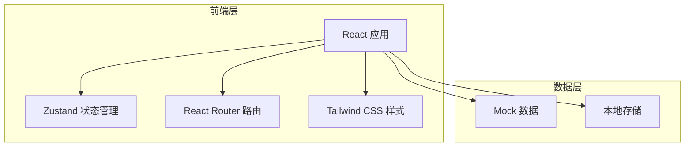
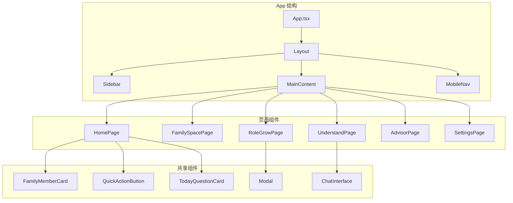

# Generations As One - 技术架构文档

**版本**: v1.0
**创建日期**: 2026-07-01

---

## 1. 架构设计



---

## 2. 技术描述

### 2.1 前端技术栈

- **框架**: React 18 + TypeScript
- **构建工具**: Vite
- **样式**: Tailwind CSS 3
- **状态管理**: Zustand
- **路由**: React Router DOM
- **图标**: Lucide React

### 2.2 项目结构

```
src/
├── components/          # 可复用组件
│   ├── Layout/          # 布局组件（侧边栏、导航栏）
│   ├── FamilyMember/    # 家庭成员相关组件
│   ├── QuickActions/    # 快捷操作组件
│   ├── Cards/           # 卡片组件
│   └── Modals/          # 弹窗组件
├── pages/               # 页面组件
│   ├── Home/            # 首页（家庭客厅）
│   ├── FamilySpace/     # 家庭空间
│   ├── RoleGrow/        # 角色养成
│   ├── Understand/      # 理解工坊
│   ├── Advisor/         # 专家顾问
│   └── Settings/        # 设置页面
├── hooks/               # 自定义 Hooks
├── store/               # Zustand 状态管理
├── utils/               # 工具函数
├── data/                # Mock 数据
├── types/               # TypeScript 类型定义
└── App.tsx              # 应用入口
```

### 2.3 后端说明

当前版本为纯前端实现，使用 Mock 数据模拟后端功能：
- 家庭成员数据存储在本地
- AI对话响应使用预设文本模拟
- 数据持久化使用 localStorage

---

## 3. 路由定义

| 路径 | 页面名称 | 描述 |
|------|---------|------|
| `/` | 首页（家庭客厅） | 默认首页，展示家庭成员、今日一问、快捷入口 |
| `/home` | 首页（家庭客厅） | 同默认路由 |
| `/family` | 家庭空间 | 家庭图谱、时光走廊、价值观、共同目标 |
| `/grow` | 角色养成 | 角色列表、点滴记录、记忆沉淀、性格洞察、私密空间 |
| `/understand` | 理解工坊 | 角色互换、沟通模拟、代际桥、冲突调解、家长监护 |
| `/advisor` | 专家顾问 | 专家列表、专家对话 |
| `/settings` | 设置 | 隐私设置、账户管理 |

---

## 4. API 模拟定义

### 4.1 TypeScript 类型定义

```typescript
// 家庭成员类型
interface FamilyMember {
  id: string;
  name: string;
  relationship: string; // '爸爸' | '妈妈' | '爷爷' | '奶奶' | '儿子' | '女儿' | '朋友' | '亲戚'
  ageGroup: string;
  avatar: string;
  similarity: number; // 相似度百分比 0-100
  createdAt: Date;
  lastInteraction: Date;
}

// 点滴记录类型
interface MemoryRecord {
  id: string;
  memberId: string;
  type: 'voice' | 'chat' | 'event' | 'photo' | 'interview' | 'daily';
  content: string;
  timestamp: Date;
  visibility: 'public' | 'semi-public' | 'private';
  tags: string[];
}

// 对话消息类型
interface ChatMessage {
  id: string;
  memberId: string;
  role: 'user' | 'ai';
  content: string;
  timestamp: Date;
}

// 专家类型
interface Expert {
  id: string;
  name: string;
  specialty: string; // '学习辅导' | '心理陪伴' | '家庭理财' | '婚姻咨询' | '亲子关系'
  avatar: string;
  description: string;
}

// 用户类型
interface User {
  id: string;
  name: string;
  avatar: string;
  isParent: boolean;
  childrenIds: string[]; // 如果是家长，管理的未成年人ID
}
```

### 4.2 Mock 数据示例

```typescript
// 家庭成员 Mock 数据
const mockFamilyMembers: FamilyMember[] = [
  {
    id: '1',
    name: '爸爸',
    relationship: '爸爸',
    ageGroup: '60后',
    avatar: 'https://trae-api-cn.mchost.guru/api/ide/v1/text_to_image?prompt=a warm smiling father in his 60s, Chinese, gentle expression, family portrait style&image_size=square',
    similarity: 92,
    createdAt: new Date('2026-01-15'),
    lastInteraction: new Date('2026-07-01'),
  },
  {
    id: '2',
    name: '妈妈',
    relationship: '妈妈',
    ageGroup: '60后',
    avatar: 'https://trae-api-cn.mchost.guru/api/ide/v1/text_to_image?prompt=a warm smiling mother in her 60s, Chinese, caring expression, family portrait style&image_size=square',
    similarity: 87,
    createdAt: new Date('2026-01-15'),
    lastInteraction: new Date('2026-06-30'),
  },
  {
    id: '3',
    name: '奶奶',
    relationship: '奶奶',
    ageGroup: '40后',
    avatar: 'https://trae-api-cn.mchost.guru/api/ide/v1/text_to_image?prompt=a warm smiling grandmother in her 80s, Chinese, loving expression, family portrait style&image_size=square',
    similarity: 76,
    createdAt: new Date('2026-02-10'),
    lastInteraction: new Date('2026-06-28'),
  },
];

// 专家 Mock 数据
const mockExperts: Expert[] = [
  {
    id: 'e1',
    name: '学习辅导员',
    specialty: '学习辅导',
    avatar: 'https://trae-api-cn.mchost.guru/api/ide/v1/text_to_image?prompt=a professional tutor, friendly, educational setting, warm colors&image_size=square',
    description: '帮助孩子制定学习计划、解答学业疑惑',
  },
  {
    id: 'e2',
    name: '心理陪伴师',
    specialty: '心理陪伴',
    avatar: 'https://trae-api-cn.mchost.guru/api/ide/v1/text_to_image?prompt=a compassionate counselor, warm smile, therapy room setting, soft lighting&image_size=square',
    description: '倾听家庭困扰、提供心理支持和建议',
  },
  {
    id: 'e3',
    name: '家庭理财顾问',
    specialty: '家庭理财',
    avatar: 'https://trae-api-cn.mchost.guru/api/ide/v1/text_to_image?prompt=a professional financial advisor, friendly, modern office, trustworthy&image_size=square',
    description: '帮助家庭规划财务、制定理财策略',
  },
];
```

---

## 5. 组件架构

### 5.1 核心组件结构



### 5.2 组件清单

| 组件名称 | 类型 | 功能描述 |
|---------|------|---------|
| `Layout` | 布局 | 整体页面布局，包含侧边栏、主内容区、底部导航（移动端） |
| `Sidebar` | 导航 | 左侧导航栏，展示主要功能入口 |
| `MobileNav` | 导航 | 移动端底部导航栏 |
| `FamilyMemberCard` | 展示 | 家庭成员头像卡片，显示姓名、相似度、支持点击和长按 |
| `FamilyMemberAvatar` | 展示 | 圆形头像组件，带呼吸动画效果 |
| `QuickActionButton` | 交互 | 快捷操作按钮，图标+文字，hover效果 |
| `TodayQuestionCard` | 展示 | 今日一问卡片，显示问题和快速回答入口 |
| `MemoryTimeline` | 展示 | 时光走廊时间轴，展示家庭记忆事件 |
| `FamilyTreeGraph` | 可视化 | 家庭图谱可视化，树状结构，支持交互 |
| `RoleCard` | 展示 | AI角色卡片，展示角色信息和操作入口 |
| `RecordingModal` | 弹窗 | 点滴记录方式选择弹窗，6种方式 |
| `PerspectiveComparison` | 展示 | 角色互换双栏对比，左右视角对比展示 |
| `ChatInterface` | 对话 | AI对话界面，消息流、输入框 |
| `ExpertCard` | 展示 | 专家卡片，头像、专长标签、快速对话 |
| `SettingsPanel` | 设置 | 设置面板，隐私设置、账户管理选项 |

---

## 6. 状态管理

### 6.1 Zustand Store 定义

```typescript
// 家庭成员状态
interface FamilyStore {
  members: FamilyMember[];
  selectedMember: FamilyMember | null;
  addMember: (member: FamilyMember) => void;
  selectMember: (member: FamilyMember | null) => void;
}

// 对话状态
interface ChatStore {
  messages: ChatMessage[];
  currentChatId: string | null;
  addMessage: (message: ChatMessage) => void;
  clearChat: () => void;
}

// 用户状态
interface UserStore {
  currentUser: User | null;
  isLoggedIn: boolean;
  login: (user: User) => void;
  logout: () => void;
}

// UI状态
interface UIStore {
  activeTab: string;
  sidebarOpen: boolean;
  modalOpen: boolean;
  setActiveTab: (tab: string) => void;
  toggleSidebar: () => void;
  toggleModal: () => void;
}
```

---

## 7. 关键交互实现

### 7.1 长按头像触发语音记录

```typescript
// 使用自定义 Hook 实现长按检测
const useLongPress = (callback: () => void, duration: number = 500) => {
  const [timerId, setTimerId] = useState<NodeJS.Timeout | null>(null);
  
  const startPress = () => {
    const id = setTimeout(callback, duration);
    setTimerId(id);
  };
  
  const endPress = () => {
    if (timerId) clearTimeout(timerId);
    setTimerId(null);
  };
  
  return {
    onMouseDown: startPress,
    onMouseUp: endPress,
    onMouseLeave: endPress,
    onTouchStart: startPress,
    onTouchEnd: endPress,
  };
};
```

### 7.2 呼吸动画效果

```typescript
// CSS 动画定义
const breathingAnimation = `
  @keyframes breathe {
    0%, 100% { transform: scale(1); }
    50% { transform: scale(1.05); }
  }
  
  .avatar-breathe {
    animation: breathe 3s ease-in-out infinite;
  }
`;
```

---

## 8. 样式系统

### 8.1 Tailwind 配置扩展

```javascript
// tailwind.config.js 扩展
module.exports = {
  theme: {
    extend: {
      colors: {
        warm: {
          50: '#FEF7ED',
          100: '#FDE6D3',
          500: '#F97316',
          600: '#EA580C',
        },
        soft: {
          blue: '#0EA5E9',
          gray: '#F5F5F4',
        },
        text: {
          primary: '#3F3F46',
          secondary: '#71717A',
        },
      },
      animation: {
        'breathe': 'breathe 3s ease-in-out infinite',
        'grow': 'grow 0.5s ease-out',
      },
      keyframes: {
        breathe: {
          '0%, 100%': { transform: 'scale(1)' },
          '50%': { transform: 'scale(1.05)' },
        },
        grow: {
          '0%': { transform: 'scale(0)', opacity: '0' },
          '100%': { transform: 'scale(1)', opacity: '1' },
        },
      },
    },
  },
};
```

### 8.2 核心样式类

| 样式类名 | 用途 | Tailwind 组合 |
|---------|------|--------------|
| `card-warm` | 温暖卡片 | `bg-warm-50 rounded-2xl shadow-sm p-4` |
| `btn-primary` | 主要按钮 | `bg-warm-500 text-white rounded-2xl px-4 py-2 hover:bg-warm-600 transition-colors` |
| `avatar-circle` | 圆形头像 | `w-12 h-12 rounded-full object-cover animate-breathe` |
| `sidebar-nav` | 侧边导航 | `flex flex-col gap-2 p-4` |

---

## 9. 性能优化

### 9.1 关键优化策略

- **组件懒加载**: 非首屏页面使用懒加载
- **图片优化**: 使用合适的图片尺寸，避免过大图片
- **动画性能**: 使用 CSS transform 而非改变布局属性
- **状态管理**: 避免不必要的状态更新，使用 Zustand 的选择器

### 9.2 响应式断点

```typescript
// Tailwind 默认断点
// sm: 640px
// md: 768px
// lg: 1024px
// xl: 1280px

// 响应式布局策略
// 桌面端（lg+）：左侧固定侧边栏 + 右侧主内容区
// 移动端（<lg）：隐藏侧边栏 + 底部导航栏
```

---

*此技术架构文档基于PRD需求设计，用于指导前端开发实现*