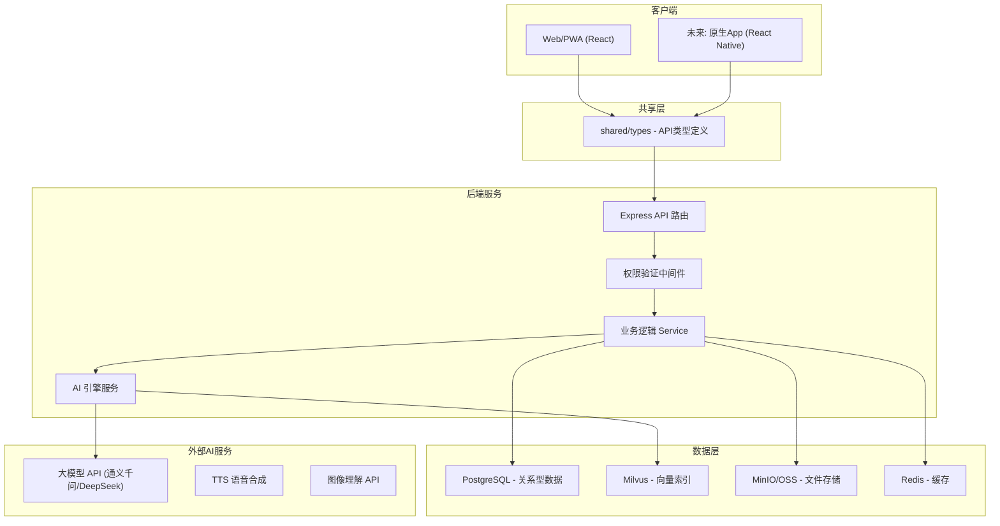
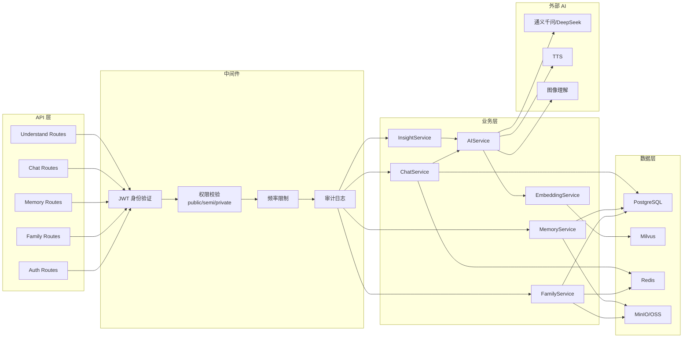
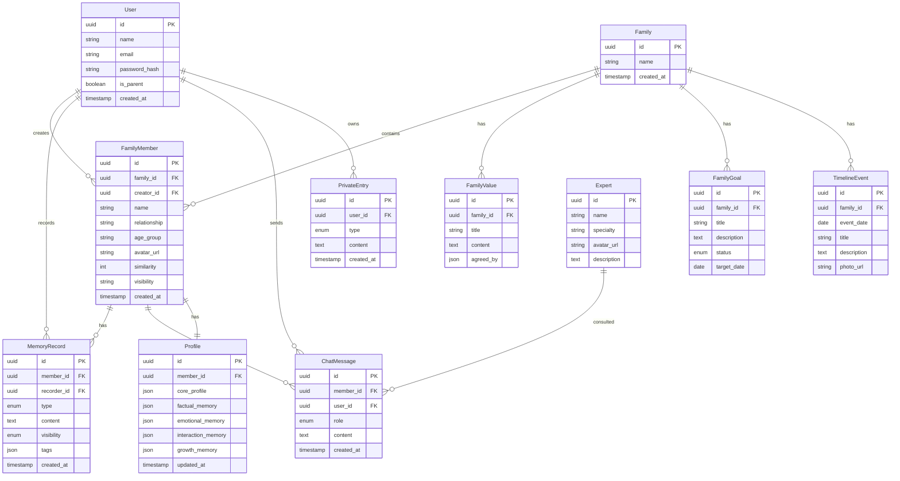

# Generations As One - 技术架构文档

**版本**: v2.0
**更新日期**: 2026-07-01
**变更说明**: 升级为多端架构（Web/PWA/未来原生App），新增完整后端服务架构（数据库、向量索引、大模型API）

---

## 1. 整体架构设计

### 1.1 多端架构总览

```
┌─────────────────────────────────────────────────────────────────┐
│                        客户端层                                  │
│  ┌──────────────┐  ┌──────────────┐  ┌──────────────────┐       │
│  │  Web + PWA   │  │ 未来: 原生App │  │ 未来: 桌面应用    │       │
│  │  (React)     │  │ (React Native)│  │ (Electron/Tauri) │       │
│  │  PC浏览器    │  │  iOS/Android  │  │  Windows/Mac    │       │
│  │  移动端浏览器 │  │              │  │                 │       │
│  └──────┬───────┘  └──────┬───────┘  └────────┬────────┘       │
│         │                 │                   │                │
└─────────┼─────────────────┼───────────────────┼────────────────┘
          │                 │                   │
          ▼                 ▼                   ▼
┌─────────────────────────────────────────────────────────────────┐
│                     共享类型层 (shared/)                         │
│  API 类型定义、DTO、错误码、常量 —— 各端复用                      │
└─────────────────────────────┬───────────────────────────────────┘
                              │
                              ▼
┌─────────────────────────────────────────────────────────────────┐
│                    后端服务层 (server/)                          │
│  ┌──────────┐ ┌──────────┐ ┌──────────┐ ┌──────────────────┐   │
│  │ API路由   │ │ 业务逻辑  │ │ 权限验证  │ │ 审计日志          │   │
│  │ (Express) │ │ (Service) │ │ (Auth)   │ │ (Audit)          │   │
│  └──────┬───┘ └──────┬───┘ └──────────┘ └──────────────────┘   │
│         │            │                                           │
│         ▼            ▼                                           │
│  ┌──────────────────────────────────────────────────────────┐   │
│  │                    AI 引擎层                              │   │
│  │  ┌──────────┐ ┌──────────┐ ┌──────────┐ ┌──────────┐   │   │
│  │  │ 大模型   │ │ 向量检索  │ │ 语音合成  │ │ 图像理解  │   │   │
│  │  │ (LLM)   │ │ (RAG)   │ │ (TTS)    │ │ (CV)     │   │   │
│  │  └──────────┘ └──────────┘ └──────────┘ └──────────┘   │   │
│  └──────────────────────────────────────────────────────────┘   │
│         │            │                                           │
│         ▼            ▼                                           │
│  ┌──────────────────────────────────────────────────────────┐   │
│  │                    数据层                                │   │
│  │  ┌──────────┐ ┌──────────────┐ ┌──────────┐ ┌─────────┐ │   │
│  │  │ 关系型DB │ │ 向量数据库    │ │ 文件存储  │ │ 缓存     │ │   │
│  │  │(PostgreSQL)│ │(Milvus/Pinecone)│ │(OSS/MinIO)│ │(Redis)  │ │   │
│  │  └──────────┘ └──────────────┘ └──────────┘ └─────────┘ │   │
│  └──────────────────────────────────────────────────────────┘   │
└─────────────────────────────────────────────────────────────────┘
```

### 1.2 架构流程图



---

## 2. 多端支持策略

### 2.1 当前阶段（Phase 1）

| 端 | 技术方案 | 说明 |
|----|---------|------|
| **PC浏览器** | React + Vite + Tailwind | 响应式设计，桌面布局 |
| **移动端浏览器** | 同上（PWA） | 响应式适配 + PWA 安装能力 |
| **后端服务** | Express + TypeScript | RESTful API，各端共用 |

### 2.2 未来阶段（Phase 2+）

| 端 | 技术方案 | 说明 |
|----|---------|------|
| **原生App** | React Native | 复用业务逻辑，原生UI体验 |
| **桌面应用** | Electron / Tauri | 基于Web代码打包 |

### 2.3 代码复用策略

```
复用关系：
├── shared/types/          → 全端复用（API类型、DTO）
├── server/                → 全端复用（后端API、AI引擎、数据库）
├── src/services/          → Web/PWA 复用（API调用层）
│   └── 未来 mobile/services/ 可直接复用接口定义
├── src/components/        → Web 专用（React DOM）
│   └── 未来 mobile/components/ 用 React Native 重写
└── src/store/             → Web 专用（Zustand）
    └── 未来 mobile/store/ 逻辑可复用，替换为 Zustand RN 版本
```

---

## 3. 项目目录结构

### 3.1 完整目录结构

```
/workspace
├── shared/                         # 共享层（前后端、各端复用）
│   └── types/
│       ├── index.ts                 # 统一导出
│       ├── api.ts                   # API 请求/响应类型
│       ├── domain.ts                # 领域模型类型
│       └── enums.ts                 # 枚举常量
│
├── src/                             # 前端（Web + PWA）
│   ├── components/
│   │   ├── common/                  # 跨端通用组件
│   │   │   ├── Layout.tsx
│   │   │   ├── Sidebar.tsx
│   │   │   └── MobileNav.tsx
│   │   ├── family/                  # 家庭相关组件
│   │   │   ├── FamilyMemberAvatar.tsx
│   │   │   └── FamilyMemberCard.tsx
│   │   ├── chat/                    # 对话相关组件
│   │   │   ├── ChatInterface.tsx
│   │   │   └── MessageBubble.tsx
│   │   └── ui/                      # 基础UI组件
│   │       ├── QuickActionButton.tsx
│   │       ├── TodayQuestionCard.tsx
│   │       └── Modal.tsx
│   ├── pages/                       # 页面组件
│   │   ├── Home.tsx
│   │   ├── FamilySpace.tsx
│   │   ├── RoleGrow.tsx
│   │   ├── Understand.tsx
│   │   ├── Advisor.tsx
│   │   └── Settings.tsx
│   ├── services/                    # API 服务层（解耦数据访问）
│   │   ├── client.ts                # HTTP 客户端封装
│   │   ├── familyService.ts         # 家庭成员服务
│   │   ├── memoryService.ts        # 点滴记录服务
│   │   ├── chatService.ts           # AI 对话服务
│   │   ├── expertService.ts         # 专家顾问服务
│   │   └── understandService.ts    # 理解工坊服务
│   ├── hooks/                       # 自定义 Hooks
│   │   ├── useFamily.ts
│   │   ├── useChat.ts
│   │   └── useLongPress.ts
│   ├── store/                       # 状态管理（Zustand）
│   │   ├── familyStore.ts
│   │   ├── chatStore.ts
│   │   ├── userStore.ts
│   │   └── uiStore.ts
│   ├── lib/                         # 工具函数
│   │   └── utils.ts
│   ├── types/                       # 前端专属类型
│   │   └── index.ts
│   ├── App.tsx
│   ├── main.tsx
│   └── index.css
│
├── server/                          # 后端服务
│   ├── src/
│   │   ├── routes/                  # API 路由
│   │   │   ├── familyRoutes.ts      # 家庭成员相关路由
│   │   │   ├── memoryRoutes.ts      # 点滴记录路由
│   │   │   ├── chatRoutes.ts         # AI 对话路由
│   │   │   ├── expertRoutes.ts      # 专家顾问路由
│   │   │   ├── understandRoutes.ts  # 理解工坊路由
│   │   │   ├── authRoutes.ts        # 认证路由
│   │   │   └── index.ts             # 路由注册
│   │   ├── services/                # 业务逻辑层
│   │   │   ├── familyService.ts     # 家庭成员业务逻辑
│   │   │   ├── memoryService.ts    # 点滴记录业务逻辑
│   │   │   ├── chatService.ts       # 对话业务逻辑
│   │   │   ├── aiService.ts         # AI 引擎调用封装
│   │   │   ├── embeddingService.ts # 向量嵌入服务
│   │   │   └── insightService.ts   # 洞察分析服务
│   │   ├── middleware/              # 中间件
│   │   │   ├── auth.ts              # 身份验证
│   │   │   ├── permission.ts        # 权限校验（数据可见性）
│   │   │   ├── rateLimit.ts        # 频率限制
│   │   │   └── auditLog.ts         # 审计日志
│   │   ├── models/                  # 数据模型
│   │   │   ├── User.ts
│   │   │   ├── FamilyMember.ts
│   │   │   ├── Memory.ts
│   │   │   ├── ChatMessage.ts
│   │   │   ├── Profile.ts           # AI 画像模型
│   │   │   └── Expert.ts
│   │   ├── db/                      # 数据库连接
│   │   │   ├── postgres.ts          # PostgreSQL 连接
│   │   │   ├── milvus.ts            # Milvus 向量库连接
│   │   │   └── redis.ts             # Redis 连接
│   │   ├── ai/                      # AI 引擎层
│   │   │   ├── llm/
│   │   │   │   ├── provider.ts      # 大模型 Provider 抽象
│   │   │   │   ├── qwen.ts          # 通义千问实现
│   │   │   │   ├── deepseek.ts     # DeepSeek 实现
│   │   │   │   └── promptTemplates/  # Prompt 模板
│   │   │   │       ├── chat.ts      # 日常对话 Prompt
│   │   │   │       ├── perspective.ts # 角色互换 Prompt
│   │   │   │       └── insight.ts   # 洞察分析 Prompt
│   │   │   ├── rag/                 # RAG 检索增强
│   │   │   │   ├── indexer.ts       # 向量索引管理
│   │   │   │   └── retriever.ts     # 向量检索
│   │   │   ├── tts/                 # 语音合成
│   │   │   │   └── provider.ts
│   │   │   └── vision/             # 图像理解
│   │   │       └── provider.ts
│   │   ├── utils/                   # 工具函数
│   │   │   ├── crypto.ts            # 加密工具（私密数据）
│   │   │   └── logger.ts            # 日志工具
│   │   ├── config/                  # 配置
│   │   │   └── index.ts
│   │   └── index.ts                 # 服务入口
│   ├── migrations/                  # 数据库迁移
│   │   └── 001_init.sql
│   ├── package.json
│   └── tsconfig.json
│
├── public/                          # PWA 静态资源
│   ├── manifest.json                # PWA 清单
│   ├── icons/                       # 应用图标
│   └── sw.js                        # Service Worker
│
├── docs/                            # 产品设计文档
├── .trae/documents/                 # 技术文档
├── package.json                     # 根 package.json（workspace）
└── vite.config.ts
```

### 3.2 关键设计原则

| 原则 | 说明 |
|------|------|
| **Services 层解耦** | 前端 Store 不直接访问 Mock 数据，通过 service 层获取，切换后端零改动 |
| **共享类型层** | `shared/types` 被前后端共同引用，保证 API 契约一致 |
| **AI 引擎抽象** | 大模型 Provider 抽象化，可切换通义千问/DeepSeek/文心一言 |
| **权限中间件** | 所有数据查询经过权限校验，确保数据隔离 |

---

## 4. 前端技术栈

| 技术 | 用途 |
|------|------|
| React 18 + TypeScript | 前端框架 |
| Vite | 构建工具 |
| Tailwind CSS 3 | 样式系统 |
| Zustand | 状态管理 |
| React Router DOM | 路由 |
| Lucide React | 图标库 |
| vite-plugin-pwa | PWA 支持（离线缓存、可安装） |

### 4.1 Services 层设计（核心解耦）

```typescript
// src/services/client.ts - HTTP 客户端
import axios from 'axios';

const apiClient = axios.create({
  baseURL: import.meta.env.VITE_API_BASE_URL || '/api',
  timeout: 30000,
});

// 请求拦截器：附加认证 token
apiClient.interceptors.request.use((config) => {
  const token = localStorage.getItem('auth_token');
  if (token) {
    config.headers.Authorization = `Bearer ${token}`;
  }
  return config;
});

export { apiClient };

// src/services/familyService.ts - 家庭成员服务
import { apiClient } from './client';
import type { FamilyMember } from '@shared/types';

export const familyService = {
  async getMembers(): Promise<FamilyMember[]> {
    const { data } = await apiClient.get('/family/members');
    return data;
  },

  async addMember(member: Omit<FamilyMember, 'id'>): Promise<FamilyMember> {
    const { data } = await apiClient.post('/family/members', member);
    return data;
  },

  async updateSimilarity(id: string): Promise<number> {
    const { data } = await apiClient.post(`/family/members/${id}/recalculate`);
    return data.similarity;
  },
};
```

### 4.2 Store 改造（从 Mock 到 Service）

```typescript
// src/store/familyStore.ts - 改造后
import { create } from 'zustand';
import { familyService } from '@/services/familyService';
import type { FamilyMember } from '@shared/types';

interface FamilyState {
  members: FamilyMember[];
  loading: boolean;
  error: string | null;
  fetchMembers: () => Promise<void>;
  addMember: (member: Omit<FamilyMember, 'id'>) => Promise<void>;
}

export const useFamilyStore = create<FamilyState>((set) => ({
  members: [],
  loading: false,
  error: null,

  fetchMembers: async () => {
    set({ loading: true, error: null });
    try {
      const members = await familyService.getMembers();
      set({ members, loading: false });
    } catch (err) {
      set({ error: '加载失败', loading: false });
    }
  },

  addMember: async (member) => {
    const newMember = await familyService.addMember(member);
    set((state) => ({ members: [...state.members, newMember] }));
  },
}));
```

---

## 5. 后端技术栈

| 技术 | 用途 |
|------|------|
| Express + TypeScript | API 服务框架 |
| PostgreSQL | 关系型数据库（用户、家庭成员、记忆记录等） |
| Milvus / Pinecone | 向量数据库（RAG 记忆检索） |
| Redis | 缓存（会话、热点数据） |
| MinIO / 阿里云 OSS | 文件存储（头像、照片、语音） |
| Prisma / TypeORM | ORM（数据库操作） |
| jsonwebtoken | JWT 身份验证 |
| 通义千问 / DeepSeek | 大语言模型 API |
| 阿里云语音 / 微软 TTS | 语音合成 |

### 5.1 服务端架构图



---

## 6. 数据模型设计

### 6.1 ER 图



### 6.2 数据隔离设计

根据隐私与安全体系要求，每条数据记录包含权限字段：

```sql
-- 所有业务表通用权限字段
visibility    VARCHAR(20) DEFAULT 'public',  -- public | semi-public | private
visible_to   UUID[],                        -- 可见的用户ID列表（半公开用）
owner_id      UUID NOT NULL,                 -- 数据创建者
encrypted     BOOLEAN DEFAULT FALSE,         -- 私密数据是否加密
```

---

## 7. API 定义

### 7.1 认证相关

| 方法 | 路径 | 说明 |
|------|------|------|
| POST | `/api/auth/register` | 用户注册 |
| POST | `/api/auth/login` | 用户登录 |
| POST | `/api/auth/refresh` | 刷新 token |
| GET | `/api/auth/me` | 获取当前用户信息 |

### 7.2 家庭成员相关

| 方法 | 路径 | 说明 |
|------|------|------|
| GET | `/api/family/members` | 获取家庭成员列表 |
| POST | `/api/family/members` | 创建家庭成员 |
| GET | `/api/family/members/:id` | 获取成员详情 |
| PUT | `/api/family/members/:id` | 更新成员信息 |
| POST | `/api/family/members/:id/recalculate` | 重新计算相似度 |
| GET | `/api/family/tree` | 获取家庭关系图谱 |
| GET | `/api/family/timeline` | 获取时光走廊事件 |
| GET | `/api/family/values` | 获取家庭价值观 |
| GET | `/api/family/goals` | 获取共同目标 |

### 7.3 点滴记录相关

| 方法 | 路径 | 说明 |
|------|------|------|
| GET | `/api/members/:id/memories` | 获取成员的记忆记录 |
| POST | `/api/members/:id/memories` | 创建点滴记录 |
| POST | `/api/memories/:id/analyze` | AI 分析记录内容 |
| POST | `/api/memories/voice` | 上传语音并转写 |
| POST | `/api/memories/photo` | 上传照片并识别 |

### 7.4 AI 对话相关

| 方法 | 路径 | 说明 |
|------|------|------|
| POST | `/api/chat/:memberId` | 与 AI 家人对话 |
| GET | `/api/chat/:memberId/history` | 获取对话历史 |
| POST | `/api/chat/:memberId/insight` | 生成对话洞察 |

### 7.5 理解工坊相关

| 方法 | 路径 | 说明 |
|------|------|------|
| POST | `/api/understand/perspective` | 角色互换分析 |
| POST | `/api/understand/simulate` | 沟通模拟 |
| POST | `/api/understand/bridge` | 代际桥问答 |
| POST | `/api/understand/conflict` | 冲突调解分析 |

### 7.6 专家顾问相关

| 方法 | 路径 | 说明 |
|------|------|------|
| GET | `/api/experts` | 获取专家列表 |
| POST | `/api/experts/:id/chat` | 与专家对话 |

### 7.7 私密空间相关

| 方法 | 路径 | 说明 |
|------|------|------|
| GET | `/api/private/entries` | 获取私密记录 |
| POST | `/api/private/entries` | 创建私密记录 |
| DELETE | `/api/private/entries/:id` | 删除私密记录 |

### 7.8 统一响应格式

```typescript
// shared/types/api.ts
export interface ApiResponse<T = unknown> {
  code: number;        // 0=成功, 非0=错误码
  message: string;     // 提示信息
  data: T;            // 业务数据
}

export interface PaginatedResponse<T> {
  code: number;
  message: string;
  data: {
    items: T[];
    total: number;
    page: number;
    pageSize: number;
  };
}
```

---

## 8. AI 引擎架构

### 8.1 大模型 Provider 抽象

```typescript
// server/src/ai/llm/provider.ts
export interface LLMProvider {
  chat(params: ChatParams): Promise<ChatResponse>;
  streamChat(params: ChatParams): AsyncGenerator<string>;
}

export interface ChatParams {
  systemPrompt: string;
  messages: { role: 'user' | 'assistant'; content: string }[];
  temperature?: number;
  model?: string;
}

// 实现：通义千问
export class QwenProvider implements LLMProvider { ... }

// 实现：DeepSeek
export class DeepSeekProvider implements LLMProvider { ... }

// 工厂：根据配置选择
export class LLMFactory {
  static create(provider: string): LLMProvider {
    switch (provider) {
      case 'qwen': return new QwenProvider();
      case 'deepseek': return new DeepSeekProvider();
      default: return new QwenProvider();
    }
  }
}
```

### 8.2 RAG 记忆检索流程

```
用户与AI家人对话
    │
    ▼
1. 接收用户消息
    │
    ▼
2. 将用户消息向量化（Embedding）
    │
    ▼
3. 在 Milvus 中检索相关记忆（Top-K）
   ┌─ 检索范围：该成员的公开记忆 + 用户可见的记忆
   └─ 不检索：用户的私密数据
    │
    ▼
4. 组装 Prompt
   ┌─ System: 成员画像 + 性格特质 + 语言风格
   ├─ Context: 检索到的相关记忆
   └─ Messages: 对话历史 + 用户消息
    │
    ▼
5. 调用大模型生成回复
    │
    ▼
6. 返回 AI 回复 + 更新对话历史
```

### 8.3 Prompt 模板管理

| 模板 | 用途 | 关键要素 |
|------|------|---------|
| `chat.ts` | 日常对话 | 成员画像、语言风格、记忆上下文 |
| `perspective.ts` | 角色互换 | 双方画像对比、场景描述、视角分析 |
| `simulate.ts` | 沟通模拟 | 对方画像、沟通效果评估、建议生成 |
| `insight.ts` | 性格洞察 | 行为模式分析、变化趋势、洞察报告 |
| `conflict.ts` | 冲突调解 | 双方立场、情感分析、调解建议 |

---

## 9. 数据隔离与权限实现

### 9.1 权限校验中间件

```typescript
// server/src/middleware/permission.ts
export async function checkDataPermission(
  req: Request,
  res: Response,
  next: NextFunction
) {
  const userId = req.user.id;        // JWT 解析的用户ID
  const memberId = req.params.id;    // 请求的家庭成员ID

  // 查询数据并校验权限
  const member = await familyService.getMemberWithPermission(memberId, userId);

  if (!member) {
    return res.status(403).json({
      code: 403,
      message: '无权访问此数据',
    });
  }

  req.member = member;  // 将权限过滤后的数据传递给下游
  next();
}
```

### 9.2 AI 数据边界

```typescript
// server/src/services/aiService.ts
export class AIService {
  // 模拟"妈妈视角"时，只查询妈妈公开 + 妈妈可见的信息
  async generatePerspective(userId: string, memberId: string, scenario: string) {
    // 1. 查询成员画像（权限过滤后）
    const profile = await profileService.getProfile(memberId, userId, 'public_or_shared');

    // 2. 检索相关记忆（权限过滤后）
    const memories = await memoryService.searchMemories(memberId, userId, scenario);

    // 3. 不查询用户私密数据
    // const privateData = await ... // 不执行

    // 4. 组装 Prompt 并调用大模型
    const prompt = perspectiveTemplate.build(profile, memories, scenario);
    return await llmProvider.chat({ systemPrompt: prompt, messages: [] });
  }

  // 模拟"用户视角"时，可使用用户私密信息
  async generateUserPerspective(userId: string, scenario: string) {
    // 可以查询用户私密信息（因为是用户自己的视角）
    const privateData = await privateService.getEntries(userId);
    // ...
  }
}
```

---

## 10. 前端路由定义

| 路径 | 页面名称 | 描述 |
|------|---------|------|
| `/` | 首页（家庭客厅） | 展示家庭成员、今日一问、快捷入口 |
| `/family` | 家庭空间 | 家庭图谱、时光走廊、价值观、共同目标 |
| `/grow` | 角色养成 | 角色列表、点滴记录、记忆沉淀、性格洞察、私密空间 |
| `/understand` | 理解工坊 | 角色互换、沟通模拟、代际桥、冲突调解、家长监护 |
| `/advisor` | 专家顾问 | 专家列表、专家对话 |
| `/settings` | 设置 | 隐私设置、账户管理 |
| `/login` | 登录 | 用户登录页 |
| `/register` | 注册 | 用户注册页 |

---

## 11. PWA 配置

### 11.1 PWA 能力

| 能力 | 说明 |
|------|------|
| 可安装 | 用户可"添加到主屏幕"，像原生App一样使用 |
| 离线缓存 | Service Worker 缓存核心资源，离线可访问 |
| 推送通知 | 未来支持今日一问推送提醒 |
| 全屏模式 | 启动时隐藏浏览器UI，沉浸式体验 |

### 11.2 实现方案

```typescript
// vite.config.ts
import { VitePWA } from 'vite-plugin-pwa';

export default defineConfig({
  plugins: [
    react(),
    VitePWA({
      registerType: 'autoUpdate',
      manifest: {
        name: 'Generations As One',
        short_name: '两代同行',
        description: '两代同行，让爱跨越时空与认知的鸿沟',
        theme_color: '#F97316',
        background_color: '#FEF7ED',
        display: 'standalone',
        icons: [
          { src: '/icons/icon-192.png', sizes: '192x192', type: 'image/png' },
          { src: '/icons/icon-512.png', sizes: '512x512', type: 'image/png' },
        ],
      },
      workbox: {
        globPatterns: ['**/*.{js,css,html,svg,png,woff2}'],
        runtimeCaching: [
          {
            urlPattern: /^https:\/\/.*\.mchost\.guru\/.*/i,
            handler: 'CacheFirst',
            options: { cacheName: 'image-cache' },
          },
        ],
      },
    }),
  ],
});
```

---

## 12. 响应式设计规范

### 12.1 断点策略

| 断点 | 宽度 | 设备 | 布局策略 |
|------|------|------|---------|
| `sm` | 640px | 手机竖屏 | 单列布局、底部导航 |
| `md` | 768px | 手机横屏/小平板 | 双列网格、底部导航 |
| `lg` | 1024px | 平板/小笔记本 | 左侧导航 + 主内容 |
| `xl` | 1280px | 桌面 | 左侧导航 + 宽内容区 |

### 12.2 端差异处理

| 功能 | PC端 | 移动端 |
|------|------|-------|
| 导航 | 左侧固定侧边栏 | 底部Tab栏 |
| 家庭图谱 | 全景树状图 | 可缩放手势图 |
| 对话 | 宽气泡布局 | 窄气泡布局 |
| 点滴记录 | 弹窗选择 | 底部弹出Sheet |
| 头像交互 | 点击对话 | 长按语音记录 |

---

## 13. 开发阶段规划

### Phase 1（当前）：前端 + Mock + PWA

- [x] 前端UI实现（6个核心页面）
- [ ] 引入 Services 层，解耦数据访问
- [ ] 添加 PWA 支持（manifest + service worker）
- [ ] 响应式优化（移动端适配）

### Phase 2：后端服务搭建

- [ ] Express + TypeScript 项目初始化
- [ ] PostgreSQL 数据库设计 + 迁移
- [ ] 用户认证（JWT）
- [ ] 基础 CRUD API（家庭成员、记忆记录）
- [ ] 前端切换到真实 API

### Phase 3：AI 引擎集成

- [ ] 大模型 Provider 接入（通义千问/DeepSeek）
- [ ] 向量数据库 Milvus 搭建
- [ ] RAG 记忆检索流程
- [ ] AI 对话功能上线
- [ ] 角色互换/沟通模拟功能上线

### Phase 4：深度功能

- [ ] 性格洞察报告
- [ ] 冲突调解室
- [ ] 语音合成（TTS）
- [ ] 图像理解（照片分析）
- [ ] 数据隔离与加密

### Phase 5：原生App（未来）

- [ ] React Native 项目初始化
- [ ] 复用 shared/types 和业务逻辑
- [ ] 原生UI实现

---

*此技术架构文档指导多端开发和后端服务建设*